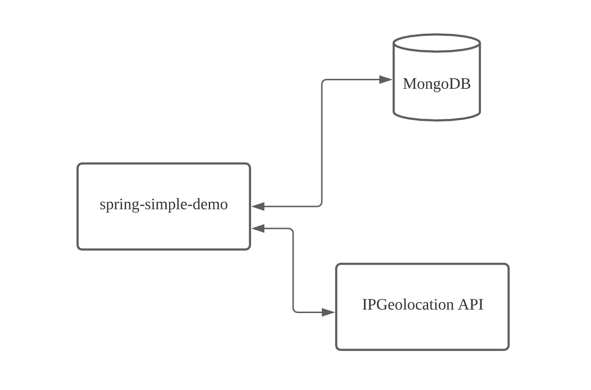

# spring-simple-demo

A simple Spring demo application expose several endpoints for demonstration purposes.

## Overview Diagram

This Spring application uses MongoDB as a datastore to manage the employee information. It also interacts with an
external API (to get IP address information)
and return a response for client.



## API Documentation

Please refer [Spring-simple-demo API Documentation](https://documenter.getpostman.com/view/1885209/Tzz7Qdi8)
for full request endpoint, HTTP Headers and request payload with example requests and responses.

## How to run the application

1. Install [JDK 11](https://www.oracle.com/java/technologies/javase-jdk11-downloads.html).
2. Install [Maven](https://maven.apache.org/download.cgi?Preferred=ftp://mirror.reverse.net/pub/apache/).
3. Register a free account at https://ipgeolocation.io/ and get your API access Key.
4. Register a free account at [MongoDB Cloud](https://www.mongodb.com/cloud/atlas), create a database and get your
   connection string.
5. Clone this project to your local machine.
6. Update your API access key and connection string in application.properties.
7. Import project to your favorite IDE or run it directly with ```mvn spring-boot:run```

That's all.
